## Project: Build a Traffic Sign Recognition Program
[](http://www.udacity.com/drive)

The Project
---
The steps of this project are the following:
* Load the data set into train, test and validate splits
* Explore, summarize and visualize the data set
* Design, train and test a model architecture
* Use the model to make predictions on new images
* Analyze the softmax probabilities of the new images


Administrative Stuff
---
1. Instead of Tensorflow, I have used Keras to build the model. The reasons behind this are as follows:
- With some prior experience in Keras, I felt it would be easier to build models using Keras
- Keras uses Tensorflow as its backend, which means all the computation is still taken care of by Tensorflow
- Finally, since there were no requirements mentioning the use of Tensorflow, Keras was the best option. Confirmed with community manager at Udacity
2. The code i.e. jupyter notebook is named [Traffic_Sign_Classifier.ipynb](https://github.com/vikramriyer/CarND-Traffic-Sign-Classifier-Project/blob/master/Traffic_Sign_Classifier.ipynb)
3. The html report is named [Traffic_Sign_Classifier.html](https://github.com/vikramriyer/CarND-Traffic-Sign-Classifier-Project/blob/master/Traffic_Sign_Classifier.html)
4. The images downloaded from the web are kept in [external_images](https://github.com/vikramriyer/CarND-Traffic-Sign-Classifier-Project/tree/master/external_images) directory

## Steps

### Dataset summary

Below are the statistics of the dataset.

|  Total Images  |Total Classes|
|----------|----------|
|51839|43|


|  Data  |Number of images|Percentage|
|----------|-----------|-----------
|Train|34799|67%|
|Validation|4410|8%|
|Test|12630|24%|

The image shape is __32x32x3__ but running models on color images is costly and has no significant benefits in terms of results.
So, in the preprocessing part of the notebook, we convert them to grayscale and hence the new image size is __32x32x1__ where __"1"__ signifies the depth of the image. 

|  Image  | Shape | Channels |
|----------|-----------|-----------
|Original Image|32x32x3|3 (RGB)|
|Processed Image|32x32x1|1 (GRAYSCALE)|


### Dataset exploration

Let's first see how the Classes are distributed. The below image will give us insights as to how many images are present in the __43__ classes that we discussed in the dataset summary section.

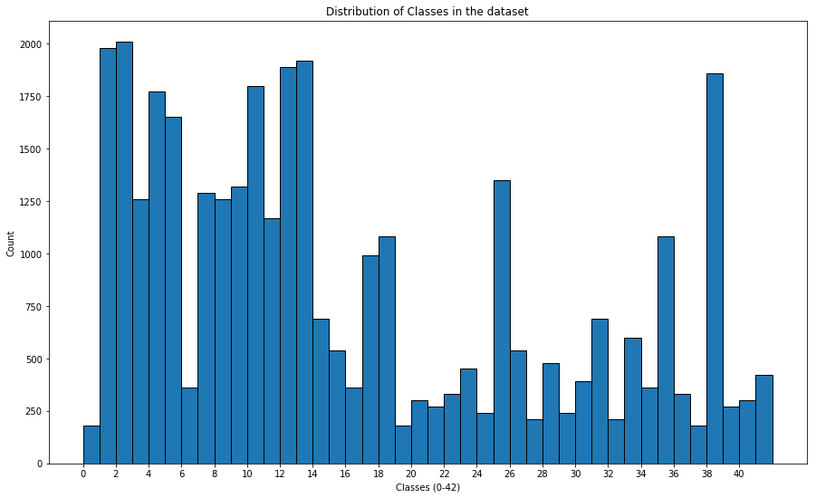

From the distribution plot it is evident that classes: "1,2,4,5,10,12,13,38" have max number of examples in the dataset. Let's try to find out what the names associated with these classes and also the images.

**WARNING:** The images have a very low resolution and hence might not be clear

||||
|:----:|:----:|:----:|
|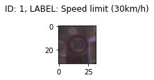|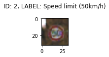|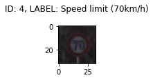|
|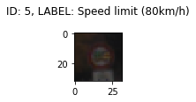|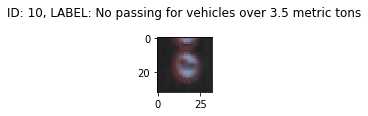|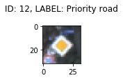|
|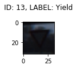|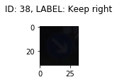|

### Preprocessing Data
The preprocessing steps we are going to follow are listed below <br>

__Grayscale conversion__ <br>
There are a lot of reasons why images are converted to gray scale in general cases like complexity of writing code for multiple channels, compute power, etc. The one that is applicable to us is that, if we look at the images in the dataset, the color does not seem to make much of difference. For example, a stop sign is a stop sign whether viewed in Black and white or gray or color. Though one may argue that the red color of stop sign makes it visible from a distance, the algorithms we use can view the images perfectly from a distance and without colors. So, for ease of processing, we will be using gray scale images.

```python
# converts an RGB image to GRAYSCALE
def grayscale(img):
    return cv2.cvtColor(img, cv2.COLOR_RGB2GRAY)
```

__Histogram Equalization__ <br>
When the images have high contrast, the perception gets better. The histogram equalization technique increases the global contrast of the pixels in the image. Due to this operation, the differences in the pixels are highly visible. For example, an edge might be highlighted better if the contrast is well set.
Since the images in our dataset have a lower resolution, this technique will help us identify the foreground and background pixels better.


```python
# performs histogra equalization
def equalize(img):
    return cv2.equalizeHist(img) # accepts only a gray scale image i.e. depth = 1
```

__Normalization__ <br>
Normalization or min-max scaling is a technique by which the values in the image are scaled to a fixed range. In our case we will fit them between 0-1. Typically in a neural network architecture, convergence is faster if the data points follow a similar distribution. 
The variance in the data is also reduced by using normalization after the zero-centering. This makes the computations faster as well, thus helping in faster convergence.


```python
def normalize(img):
    return img/255
```

Let's view how the original image and preprocessed image look
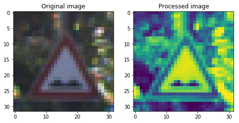

### Model Architecture and Training

Below is the architecture of the Model, a modified version as inspired from LeNet.

|  Layer  | Output_Shape | Total_Parameters |
|----------|-----------|-----------
| conv layer 1| 28x28x60 | 5x5x60+60=__1560__ |
| conv layer 2| 24x24x60 | 5x5x60x60+60=__90060__ |
| max pool| 12x12x60 | __0__ |
| conv layer 3| 10x10x30 | 3x3x30x60+30=__16230__ |
| conv layer 4| 8x8x30 |3x3x30x30+30=__8130__ |
| max pool| 4x4x30 | __0__ |
| flatten | 4x4x30=__480__ | __0__ |
| fully connected layer 1| 500 | 480*500+500=__240500__ |
| dropout | 500 | __0__ |
| fully connected layer 2| 43 | 500*43+43=__21543__ |

The activation functions:

|  Activation  | Comments |
|----------|-----------|
| RELU | Used at the conv layers |
| SOFTMAX | Used at the last to get the probabilities of the classes |

Let's find out in short what each of the layers do: <br>
**Conv layer** <br>
We (rather the library) use a kernel or a filter that is a matrix of values and we do simple matrix multiplication and get values that are passed on as inputs to the next layers. This operation finds out certain details about the image like edges, vertices, circles, faces, etc. These kernels are chosen at random by the library and each of these produce some form of results about the features. These kernels are

**Max Pool** <br>
We simply reduce the dimentionality of the images. This methods uses the knowledge about the fact that the adjacent pixels have almost the similar contribution in terms of view of an image and hence can be removed. There are 2 famous types of pooling methods, namely, max-pooling and average pooling. In our architecture, we use the max-pooling where from a 2x2 matrix, the max value is used to construct a mapping with single pixel value.

**Fully connected layer** <br>
The convolutional layers learn some low level features and to make most of the non-linearities, we use the FC layers that perform combinations of these features and find the best of these to use. This process is again done by using back propogation which learns the best of combinations.

**Dropout** <br>
We randomly drop some information from the network. Though there is a experimental proof about this working well, we can in short say that this method reduces over fitting. It is a form of Regularization.

#### Training
Finally that our architecture is decided, we use the __Adam optimizer__ for training the model. We would not go into details of how the Adam optimizer works but in short we can say that, "**An optimizer in general minimizes the loss in the network.**"

The hyperparameters: 

|  Name  | Value |
|----------|-----------|
| EPOCHS | 10 |
| LEARNING RATE | 0.001 |
| BATCH SIZE | 128 |

### Performance on Train, Validation and Test set

|  Data  | Accuracy |
|----------|-----------|
| Train | 99.15% |
| Validation | 97.35% |
| Test | 95.04% |

Below is the graph of the accuracy of Train and Validation set through the epochs

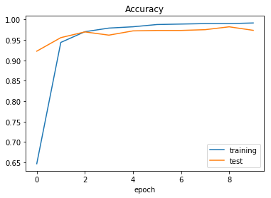

Below we have the graph of loss of Train and Validation set through epochs

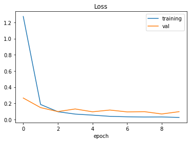

We can say that though the accuracy on the whole is good, i.e. a 95% accuracy on the test set, we can observe that the data has overfit a little to the train data as the difference in the accuracies of Train and Validation are noticeably high. We can ossibly use some other techniques that will be helpful in reducing this over fitting.

### Performance on Images downloaded from the web

Let's the images that we downloaded from the web

||||
|:----:|:----:|:----:|
|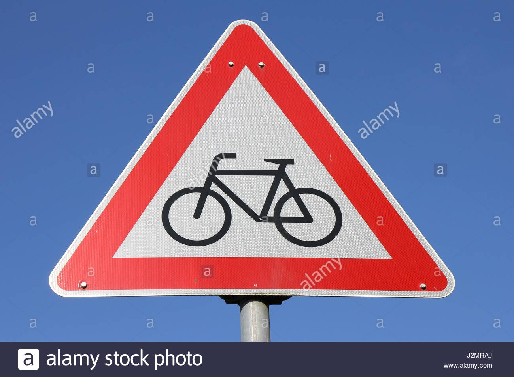|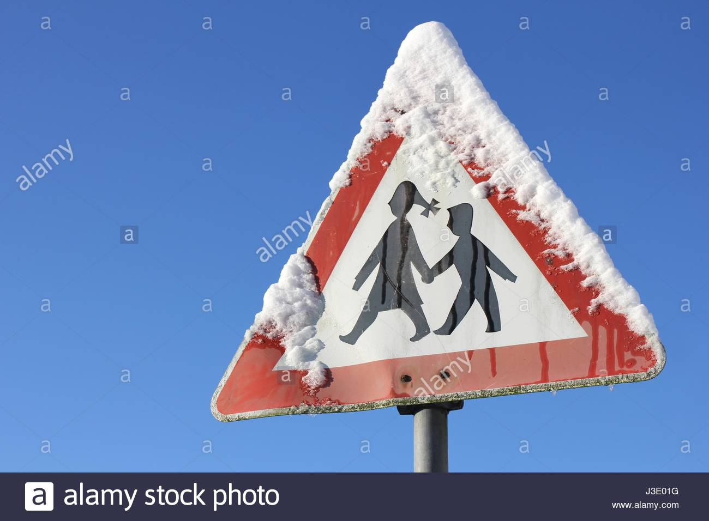||
||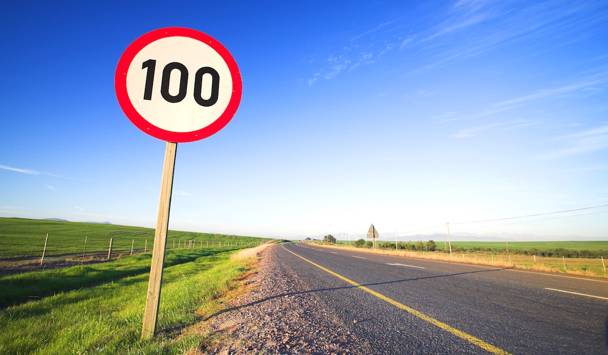||
|||

Now, lets see how our model has performed on these images

|  Original Image  | Predicted Image | 
|----------|-----------|
| Give Way | Priority road |
| Bicycles Crossing | Speed limit (80km/h) |
| Children Crossing | Priority road |
| Speed limit (30km/h) | Speed limit (30km/h) |
| Turn right ahead | Turn right ahead |
| Slippery road | Slippery road |
| Speed Limit 100 | Traffic signals |
| Turn Left Ahead | Right-of-way at the next intersection |

We can see that our model has an accuracy of __26%__ predicting 3 out of 8 correctly on the images that were picked from the web. <br>
The correct predictions were for __Speed limit 30, slippery road and turn right__

Here are some of the reasons I could think of: <br>
- The bounding boxes when similar create problems in the model being able to predict which class it belongs to.
- I purposefully used an image which had snow on the board and this definitely might have create a problem.
- I also believe that the dataset was not that huge, or I should rephrase saying, "A deep learning model probably might require more examples to learn."

In summary, the model seems to have overfit on our images and we might have to use some other techniques that will provide us with more examples.

### Top probabilities using Softmax

#### Image 1: Give_Way
The top 5 probabilities are:
1. Priority road : 0.9361149072647095
2. Yield : 0.042106494307518005
3. Speed limit (50km/h) : 0.01146041601896286
4. Ahead only : 0.006828222423791885
5. No passing for vehicles over 3.5 metric tons : 0.0008564031450077891


#### Image 2: Bicycles_Crossing
The top 5 probabilities are:
1. Speed limit (80km/h) : 0.6079292297363281
2. Road work : 0.27933549880981445
3. Dangerous curve to the left : 0.06612427532672882
4. Wild animals crossing : 0.01839737966656685
5. No passing for vehicles over 3.5 metric tons : 0.011532790027558804

#### Image 3: Children_Crossing
The top 5 probabilities are:
1. Priority road : 0.9970569610595703
2. Right-of-way at the next intersection : 0.002387598855420947
3. Roundabout mandatory : 0.000504632480442524
4. Speed limit (50km/h) : 2.4812457922962494e-05
5. Speed limit (80km/h) : 4.578428615786834e-06

#### Image 4: Speed_Limit_30
The top 5 probabilities are:
1. Speed limit (30km/h) : 0.9980493783950806
2. Speed limit (80km/h) : 0.0018244765233248472
3. Speed limit (70km/h) : 5.744009104091674e-05
4. Speed limit (50km/h) : 4.1975046769948676e-05
5. Speed limit (20km/h) : 1.2784315003955271e-05

#### Image 5: Turn_Right
The top 5 probabilities are:
1. Turn right ahead : 0.9916664958000183
2. Speed limit (100km/h) : 0.004743786063045263
3. Right-of-way at the next intersection : 0.0020530198235064745
4. Speed limit (80km/h) : 0.0015015793032944202
5. Keep left : 1.2370042895781808e-05

#### Image 6: Slippery_Road
The top 5 probabilities are:
1. Slippery road : 0.9823325276374817
2. Wild animals crossing : 0.01735144667327404
3. Dangerous curve to the left : 0.0001537348289275542
4. Dangerous curve to the right : 7.590623135911301e-05
5. Bumpy road : 3.308977102278732e-05

#### Image 7: Speed_Limit_100
The top 5 probabilities are:
1. Traffic signals : 0.6682420969009399
2. Priority road : 0.2763347923755646
3. Keep right : 0.03145572915673256
4. Speed limit (120km/h) : 0.007720984984189272
5. Roundabout mandatory : 0.006608124822378159

#### Image 8: Turn_Left_Ahead
The top 5 probabilities are:
1. Right-of-way at the next intersection : 0.7673993706703186
2. Speed limit (80km/h) : 0.12868334352970123
3. Stop : 0.045555271208286285
4. Speed limit (50km/h) : 0.02374788373708725
5. Priority road : 0.019778218120336533

### Discussion about the certainity of the Model
Let's discuss the images one by one <br>
- __Give way__
We can see that the model hasn't been able to identify the image correctly and none of the top 5 probabilities match that of the original label
- __Bicycles Crossing__ 
Though the prediction is incorrect and the top 5 probabilitie listed do not match the original label, we can see another form of crossing i.e. Wild animal crossing making its way in the top 5 though the probability is negligible. There are still signs of promise :)
- __Children Crossing__
The prediction is incorrect
- __Speed Limit 30__
The prediction is correct and all the top 5 probabilities relate to the speed limit sign. This is really cool and the model is not a complete failure it seems :))
- __Turn Right__
The prediction is correct again. An interesting observation is that Keep left makes it to the top of probability list. The model needs to learn to distinguish between left and right
- __Slippery Road__ 
Correct prediction
- __Speed Limit 100__ 
Incorrect prediction. However, Speed limit 120 makes it to the list of top 5
- __Turn left__

As we discussed before, we can see that the model is not probably not able to distinguish between left and right. There is a chance for improvement.

## Discussion
---

### Potential Shortcomings in the Project
1. __Over Fitiing__
It is evident from the Train vs Validation accuracy plot that the model currently is prone to over-fitting. 
2. __Need of more Data__
Even though acceptable in case of Deep Learning, there are techniques like few shot learning and one shot learning which shine when there are fewer images. 

### Possible Improvements
1. __Hyperparameter Tuning__
The simplest way can be to tune the model even further. 
2. __Learning Rate Annealing__
We use a constant learning rate over all the epochs. However, there is a technique used that can change the learning rate. The technique is something like this, we use a higher training rate in the beginning and look at the graph of validation and train accuracy/loss. Depending on the convergence, we lower it and repeatedly do this process until convergence. Intuitively this looks like an acceptable method as the training might be faster and meaningful.
3. __Augmentation__
As we saw in the Dataset Summary section, we have fewer images when it comes to training a Deep Learning model, so some augmentation techniques like Rotations, Transformations, etc could be really helpful.
